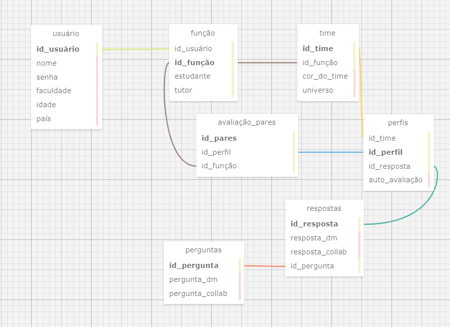

# Ponderada_3

# Modelagem de Banco de Dados




# Readme
- Nome do Projeto: Modelagem de Banco de Dados
- Descrição: O propósito deste documento README é introduzir a ponderada da semana 3, que solicitou a aplicação dos princípios de relacionamento 1:N (um para muitos), N:N (muitos para muitos) e a conexão entre chaves primárias e estrangeiras. Este trabalho está em conformidade com as regras de negócio estabelecidas pelo parceiro desde a primeira sprint; o modelo inclui uma documentação detalhada em markdown. Este repositório contém os arquivos de modelagem (.xml) e documentação.
Uma estrutura de banco de dados bem elaborada é fundamental para assegurar a eficiência, integridade e consistência dos dados em um sistema de gerenciamento de banco de dados
- Arquitetura: Banco de Dados Relacional
- Ferramenta de Diagramação: SQL Designer

# 1. Modelagem Relacional:

## Usuário:
A entidade Usuários representa os usuários do sistema.
### Atributos:
- id_usuário: identificador próprio de cada pessoa que se cadastra.
- nome: nome do usuário.
- senha: senha que o usuário irá definir 
- faculdade: faculdade do usuário
- idade: idaide do usuário.
- país: país em que o usuário nasceu.

## Função:
A entidade função representa a função que o usuário poderá exercer dentro da plataforma.
### Atributos:
- id_usuário: chave-estrangeira derivada da entidade "usuário".
- id_função: identificador próprio da função que o usuário exerce.
- estudante: atributo de estudante para a pessoa que exerce essa função.
- tutor: atributo de tutor para a pessoa que exerce essa função.

## Time:
A entidade time reune todos os usuários que possuem funções e os dividem pelo time.
### Atributos:
- id_time: chave-primária para identificar cada time, sendo que cada um tem um identificador próprio.
- id_função: chave-estrangeira da entidade "função"
- cor_do_time: atributo que diferencia cada time dentro do universo.
- universo: atributo que diferencia cada "mundo" dentro do jogo, sendo que é utilizado para não repetir cores dentro do mesmo universo.

## Perguntas:
Entidade que gera as perguntas de cada questionário.
### Atributos:
- id_pergunta: chave-primária que define o identificador próprio de cada pergunta.
- pergunta_dm: perguntas que são direcionadas para o perfil de tomador de decisão.
- pergunta_collab:perguntas que são direcionada para o perfil de colaborador.

## Respostas:
Entidade que armazena as respostas de cada pergunta para gerar o perfil.
### Atributos:
- id_resposta: identificador para cada resposta
- resposta_dm: respostas que geram o perfil de tomador de decisões.
- resposta_collab: respostas que geram o perfil de colaborador.
- id_pergunta: chave-estrangeira que deriva da entidade de perguntas.

## Perfis:
Entidade que gera o perfil de cada estudante dentro do jogo por meio das respostas respondidas.
### Atributos:
- id_time: chave-estrangeira da entidade "time".
- id_perfil: chave primária que define o perfil derivado das perguntas e respostas.
- id_resposta: chave-estrangeira que deriva da entidade "respostas".
- auto_avaliação: atributo que gera o questionário de auto-avaliação.

## Avaliação_pares:
A entidade avaliação de pares serve para cada usuário avaliar um estudante. 
### Atributos:
- id_pares:identificador para cada avaliação dos pares.
- id_perfil: perfil de cada estudante de cada time.
- id_função: chave-estrangeira para identificar quem está sendo avaliado e quem está avaliando.

## Relacionamentos:

1. **Relacionamento 1:1**:
   - **Perfis - Avaliação de pares**: Cada perfil está associado a uma única avaliação de pares, e cada avaliação de pares está associada a apenas um perfil.
   
2. **Relacionamento 1:N**:
   - **Função - Time** Um time pode ser associado a múltiplas funções. Mas uma função só pode ser associada a um time. 
   - **Função - Avaliação de pares**:  Uma função pode ser associada somente a várias avaliações de pares. Mas uma avaliação de pares só pode ser associada a uma função.
   - **Respostas - Perfis**: Múltiplas respostas podem estar associadas a um único perfil, enquanto um perfil pode estar associado a várias respostas.
    - **Time - Perfis**: Um time pode ser associado a vários perfis, mas um perfil só pode ser associado a um time.
    - **Usuário - Função**: Cada usuário pode estar associado a apenas uma função, mas cada função pode ser associada à vários usuários.

3. **Relacionamento N:N**:
   - **Perguntas - Respostas**: Múltiplas perguntas podem ter múltiplas respostas, e múltiplas respostas podem estar associadas a múltiplas perguntas.


# 2. Modelagem (.xml):

<?xml version="1.0" encoding="utf-8" ?>
<!-- SQL XML created by WWW SQL Designer, https://github.com/ondras/wwwsqldesigner/ -->
<!-- Active URL: https://sql.toad.cz/ -->
<sql>
<datatypes db="mysql">
	<group label="Numeric" color="rgb(238,238,170)">
		<type label="Integer" length="0" sql="INTEGER" quote=""/>
	 	<type label="TINYINT" length="0" sql="TINYINT" quote=""/>
	 	<type label="SMALLINT" length="0" sql="SMALLINT" quote=""/>
	 	<type label="MEDIUMINT" length="0" sql="MEDIUMINT" quote=""/>
	 	<type label="INT" length="0" sql="INT" quote=""/>
		<type label="BIGINT" length="0" sql="BIGINT" quote=""/>
		<type label="Decimal" length="1" sql="DECIMAL" re="DEC" quote=""/>
		<type label="Single precision" length="0" sql="FLOAT" quote=""/>
		<type label="Double precision" length="0" sql="DOUBLE" re="DOUBLE" quote=""/>
	</group>

	<group label="Character" color="rgb(255,200,200)">
		<type label="Char" length="1" sql="CHAR" quote="'"/>
		<type label="Varchar" length="1" sql="VARCHAR" quote="'"/>
		<type label="Text" length="0" sql="MEDIUMTEXT" re="TEXT" quote="'"/>
		<type label="Binary" length="1" sql="BINARY" quote="'"/>
		<type label="Varbinary" length="1" sql="VARBINARY" quote="'"/>
		<type label="BLOB" length="0" sql="BLOB" re="BLOB" quote="'"/>
	</group>

	<group label="Date &amp; Time" color="rgb(200,255,200)">
		<type label="Date" length="0" sql="DATE" quote="'"/>
		<type label="Time" length="0" sql="TIME" quote="'"/>
		<type label="Datetime" length="0" sql="DATETIME" quote="'"/>
		<type label="Year" length="0" sql="YEAR" quote=""/>
		<type label="Timestamp" length="0" sql="TIMESTAMP" quote="'"/>
	</group>
	
	<group label="Miscellaneous" color="rgb(200,200,255)">
		<type label="ENUM" length="1" sql="ENUM" quote=""/>
		<type label="SET" length="1" sql="SET" quote=""/>
		<type label="Bit" length="0" sql="bit" quote=""/>
	</group>
</datatypes><table x="543" y="42" name="time">
<row name="id_time" null="1" autoincrement="1">
<datatype>INTEGER</datatype>
<default>NULL</default></row>
<row name="id_função" null="1" autoincrement="0">
<datatype>INTEGER</datatype>
<default>NULL</default><relation table="função" row="id_função" />
</row>
<row name="cor_do_time" null="1" autoincrement="0">
<datatype>CHAR</datatype>
<default>NULL</default></row>
<row name="universo" null="1" autoincrement="0">
<datatype>VARCHAR</datatype>
<default>NULL</default></row>
<key type="PRIMARY" name="">
<part>id_time</part>
</key>
</table>
<table x="100" y="43" name="usuário">
<row name="id_usuário" null="1" autoincrement="1">
<datatype>INTEGER</datatype>
<default>NULL</default></row>
<row name="nome" null="1" autoincrement="0">
<datatype>VARCHAR</datatype>
<default>NULL</default></row>
<row name="senha" null="1" autoincrement="0">
<datatype>VARCHAR</datatype>
<default>NULL</default></row>
<row name="faculdade" null="1" autoincrement="0">
<datatype>VARCHAR</datatype>
<default>NULL</default></row>
<row name="idade" null="1" autoincrement="0">
<datatype>VARCHAR</datatype>
<default>NULL</default></row>
<row name="país" null="1" autoincrement="0">
<datatype>CHAR</datatype>
<default>NULL</default></row>
<key type="PRIMARY" name="">
<part>id_usuário</part>
</key>
</table>
<table x="321" y="403" name="perguntas">
<row name="id_pergunta" null="1" autoincrement="0">
<datatype>INTEGER</datatype>
<default>NULL</default></row>
<row name="pergunta_dm" null="1" autoincrement="0">
<datatype>CHAR</datatype>
<default>NULL</default></row>
<row name="pergunta_collab" null="1" autoincrement="0">
<datatype>CHAR</datatype>
<default>NULL</default></row>
<key type="PRIMARY" name="">
<part>id_pergunta</part>
</key>
</table>
<table x="523" y="334" name="respostas">
<row name="id_resposta" null="1" autoincrement="1">
<datatype>INTEGER</datatype>
<default>NULL</default></row>
<row name="resposta_dm" null="1" autoincrement="0">
<datatype>CHAR</datatype>
<default>NULL</default></row>
<row name="resposta_collab" null="1" autoincrement="0">
<datatype>CHAR</datatype>
<default>NULL</default></row>
<row name="id_pergunta" null="1" autoincrement="0">
<datatype>INTEGER</datatype>
<default>NULL</default><relation table="perguntas" row="id_pergunta" />
</row>
<key type="PRIMARY" name="">
<part>id_resposta</part>
</key>
</table>
<table x="375" y="191" name="avaliação_pares">
<row name="id_pares" null="1" autoincrement="0">
<datatype>INTEGER</datatype>
<default>NULL</default></row>
<row name="id_perfil" null="1" autoincrement="0">
<datatype>INTEGER</datatype>
<default>NULL</default><relation table="perfis" row="id_perfil" />
</row>
<row name="id_função" null="1" autoincrement="0">
<datatype>INTEGER</datatype>
<default>NULL</default><relation table="função" row="id_função" />
</row>
<key type="PRIMARY" name="">
<part>id_pares</part>
</key>
</table>
<table x="653" y="191" name="perfis">
<row name="id_time" null="1" autoincrement="0">
<datatype>INTEGER</datatype>
<default>NULL</default><relation table="time" row="id_time" />
</row>
<row name="id_perfil" null="1" autoincrement="1">
<datatype>INTEGER</datatype>
<default>NULL</default></row>
<row name="id_resposta" null="1" autoincrement="0">
<datatype>INTEGER</datatype>
<default>NULL</default><relation table="respostas" row="id_resposta" />
</row>
<row name="auto_avaliação" null="1" autoincrement="0">
<datatype>CHAR</datatype>
<default>NULL</default></row>
<key type="PRIMARY" name="">
<part>id_perfil</part>
</key>
</table>
<table x="330" y="42" name="função">
<row name="id_usuário" null="1" autoincrement="0">
<datatype>INTEGER</datatype>
<default>NULL</default><relation table="usuário" row="id_usuário" />
</row>
<row name="id_função" null="1" autoincrement="1">
<datatype>INTEGER</datatype>
<default>NULL</default></row>
<row name="estudante" null="1" autoincrement="0">
<datatype>INTEGER</datatype>
<default>NULL</default></row>
<row name="tutor" null="1" autoincrement="0">
<datatype>INTEGER</datatype>
<default>NULL</default></row>
<key type="PRIMARY" name="">
<part>id_função</part>
</key>
</table>
</sql>


***PostgreSql:***
```
CREATE TABLE "time" (
    "id_time" SERIAL PRIMARY KEY,
    "id_função" INTEGER,
    "cor_do_time" CHAR,
    "universo" VARCHAR,
    FOREIGN KEY ("id_função") REFERENCES "função" ("id_função")
);

CREATE TABLE "usuário" (
    "id_usuário" SERIAL PRIMARY KEY,
    "nome" VARCHAR,
    "senha" VARCHAR,
    "faculdade" VARCHAR,
    "idade" VARCHAR,
    "país" CHAR
);

CREATE TABLE "perguntas" (
    "id_pergunta" INTEGER PRIMARY KEY,
    "pergunta_dm" CHAR,
    "pergunta_collab" CHAR
);

CREATE TABLE "respostas" (
    "id_resposta" SERIAL PRIMARY KEY,
    "resposta_dm" CHAR,
    "resposta_collab" CHAR,
    "id_pergunta" INTEGER,
    FOREIGN KEY ("id_pergunta") REFERENCES "perguntas" ("id_pergunta")
);

CREATE TABLE "avaliação_pares" (
    "id_pares" INTEGER PRIMARY KEY,
    "id_perfil" INTEGER,
    "id_função" INTEGER,
    FOREIGN KEY ("id_perfil") REFERENCES "perfis" ("id_perfil"),
    FOREIGN KEY ("id_função") REFERENCES "função" ("id_função")
);

CREATE TABLE "perfis" (
    "id_time" INTEGER,
    "id_perfil" SERIAL PRIMARY KEY,
    "id_resposta" INTEGER,
    "auto_avaliação" CHAR,
    FOREIGN KEY ("id_time") REFERENCES "time" ("id_time"),
    FOREIGN KEY ("id_resposta") REFERENCES "respostas" ("id_resposta")
);

CREATE TABLE "função" (
    "id_usuário" INTEGER,
    "id_função" SERIAL PRIMARY KEY,
    "estudante" INTEGER,
    "tutor" INTEGER,
    FOREIGN KEY ("id_usuário") REFERENCES "usuário" ("id_usuário")
);