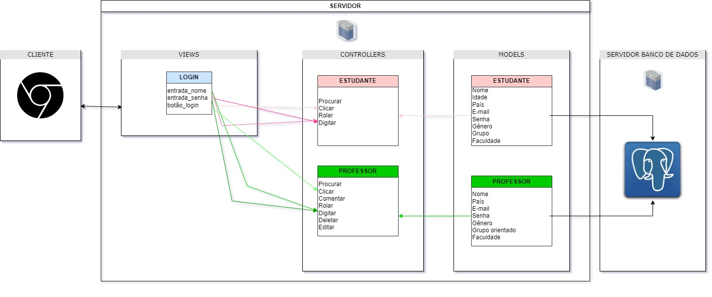
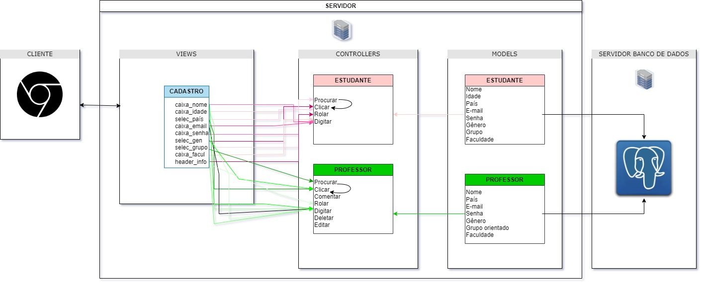
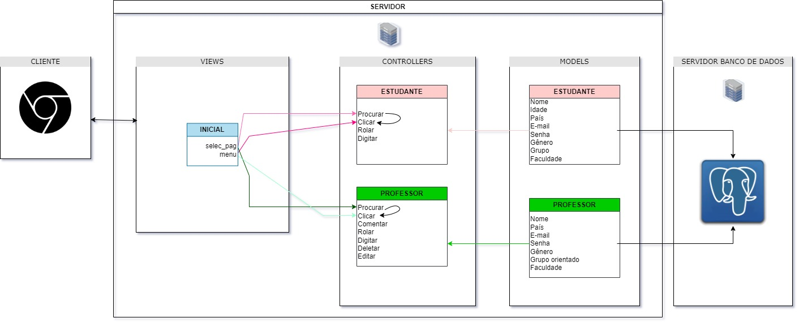
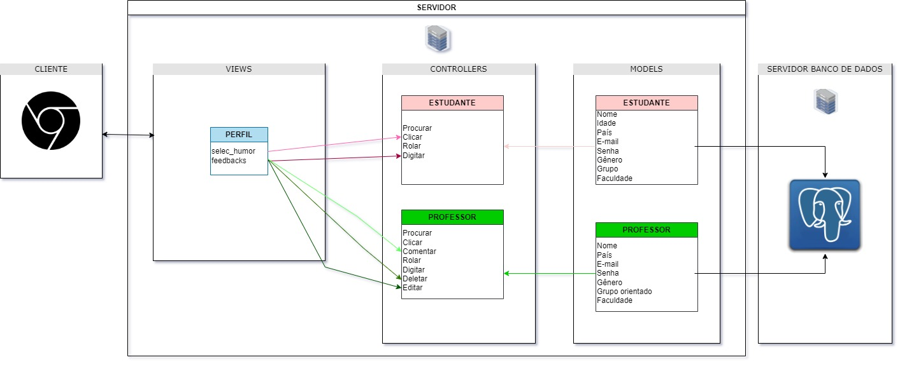
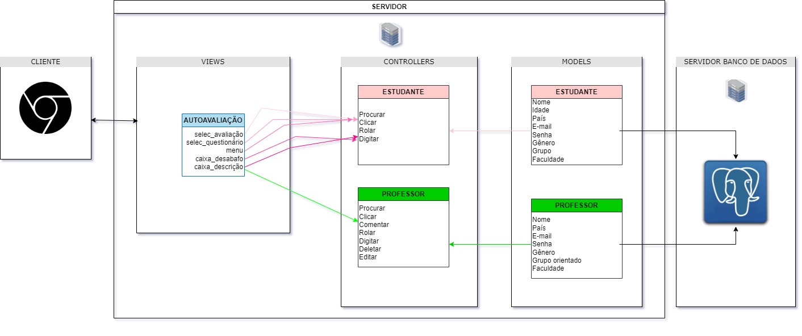

# Arquitetura MVC

- Nome do Projeto: Culturation
- Descrição: O projeto Culturation baseia-se em um sistema web criado para a integração dos alunos que participam do jogo "Cesim Game", com o propósito de facilitar uma cooperação mais sólida e uma comunicação transparente entre os membros do grupo.
- Arquitetura: MVC (Model-View-Controller)
- Ferramenta de Diagramação: draw.io

  Figura 1 - Arquitetura MVC: Login 
  
  Fonte: Elaborado pela autora (2024)

  Figura 1 - Arquitetura MVC: Cadastro 
  
  Fonte: Elaborado pela autora (2024)

  Figura 1 - Arquitetura MVC: Tela Incial 
  
  Fonte: Elaborado pela autora (2024)

  Figura 1 - Arquitetura MVC: Perfil 
  
  Fonte: Elaborado pela autora (2024)

  Figura 1 - Arquitetura MVC: Autoavaliação
  
  Fonte: Elaborado pela autora (2024)

### Modelos (Models):

- Estudante: Esta é a entidade principal do projeto, pois armazena todos os dados dos alunos participantes do jogo. Os atributos incluem nome, idade, país, email, senha, gênero, grupo e faculdade. Os estudantes são os participantes ativos do jogo, que interagem com o sistema e entre si.
- Tutor: Esta é a entidade que representa os professores ou orientadores do projeto. Eles têm atributos semelhantes aos dos estudantes, como nome, país, email, senha e gênero, além do grupo orientado e faculdade. Os tutores são responsáveis por orientar e apoiar os estudantes em seus objetivos na simulação.
 
&nbsp;&nbsp;&nbsp;&nbsp;A relação entre essas entidades é de que um tutor pode orientar um ou mais grupos. Isso significa que um grupo de estudantes pode estar associado a um tutor específico. Por exemplo, um tutor pode ser responsável por orientar um grupo de estudantes em um determinado momento.

### Controladores (Controllers):
- Os controladores do projeto são: procurar, clicar, rolar, digitar, comentar, deletar e editar.
1. Procurar: Este controlador é responsável por permitir que os usuários busquem informações dentro do sistema. Isso envolve a filtragem para encontrar dados específicos.
2. Clicar: Este controlador permite aos usuários interagir com elementos clicáveis dentro do sistema. Isso inclui botões, links e outros elementos de interface do usuário que respondem ao clique do usuário.
3. Rolar: O controlador de rolagem permite aos usuários percorrer o conteúdo em uma página ou aplicativo. Isso é essencial para visualizar informações que não cabem completamente na tela.
4. Digitar: Este controlador permite aos usuários inserir texto ou dados em campos de entrada. Isso é fundamental para realizar tarefas como preencher formulários, enviar mensagens ou realizar buscas.
5. Comentar: O controlador de comentários permite aos usuários adicionar comentários ou feedback em determinados conteúdos dentro do sistema.
6. Deletar: Este controlador permite aos usuários remover itens ou conteúdos do sistema. Isso pode incluir a exclusão de mensagens, arquivos ou outros dados.
7. Editar: O controlador de edição permite aos usuários modificar ou atualizar informações existentes no sistema. 

&nbsp;&nbsp;&nbsp;&nbsp;Para buscar informações, o método `buscar` é utilizado, recebendo uma `consulta` que contém os termos de pesquisa e, opcionalmente, `filtros` para refinar os resultados. A saída desse método é uma lista de `resultados` que correspondem à consulta.
 
&nbsp;&nbsp;&nbsp;&nbsp;Ao clicar em elementos da interface, como botões ou links, o método `clicar` é acionado, utilizando o `elemento` como parâmetro de entrada. 
 
&nbsp;&nbsp;&nbsp;&nbsp;Para rolar a página ou uma área específica, o método `rolar` é utilizado, recebendo a `direcao` da rolagem (para cima ou para baixo) e, opcionalmente, a `distancia` em pixels a ser rolada.
 
&nbsp;&nbsp;&nbsp;&nbsp;Quando é necessário inserir texto em campos de entrada, como formulários ou caixas de texto, o método `digitar` é chamado, utilizando o `elemento` como identificador do campo e o `texto` a ser digitado como entrada.
 
&nbsp;&nbsp;&nbsp;&nbsp;Para adicionar comentários a conteúdos específicos, o método `comentar` é utilizado, recebendo o `conteudo` do comentário e o `alvo` do comentário, que pode ser um post, uma mensagem, etc. A saída desse método é o `idComentario`, que identifica unicamente o comentário postado.
 
&nbsp;&nbsp;&nbsp;&nbsp;Quando é necessário excluir um item do sistema, o método `deletar` é acionado, utilizando o `item` a ser excluído como parâmetro de entrada. A saída é um indicador de `sucesso` ou falha na exclusão do item.
 
&nbsp;&nbsp;&nbsp;&nbsp;Por fim, para editar conteúdo existente, o método `editar` é utilizado, recebendo o `idConteudo` do conteúdo a ser editado e o `novoConteudo` que substituirá o original. A saída é o `conteudoAtualizado`, que reflete as alterações feitas.
 
&nbsp;&nbsp;&nbsp;&nbsp;Ademais, os controllers interagem com as views e com os models, sendo que os controladores batuam como intermediários entre os models e as views. Além disso, os controladores recebem entradas do usuário das views e as encaminham para os models.

### Views (Views):
As views do projeto são a tela de login, tela de cadastro, tela inicial, tela de perfil e tela de autoavaliação.
1. Tela de Login:
Exibe campos para inserção de nome de usuário e senha.
Permite que o usuário envie suas credenciais para autenticação.
Exibe mensagens de erro caso as credenciais estejam incorretas.
Possivelmente fornecerá opções para redefinição de senha ou criação de uma nova conta.

2. Tela de Cadastro:
Exibe campos para inserção de informações necessárias para criar uma conta, como nome, email, senha, etc.
Realiza validação dos dados inseridos pelo usuário.
Envia as informações para o servidor para criar uma nova conta no sistema, ou verificar se já existe uma conta criada.
Exibe mensagens de sucesso ou erro após o processo de cadastro.

3. Tela Inicial:
Apresenta informações gerais sobre o projeto.
Apresenta ao usuário "Tutor", informações sobre todos os integrantes do grupo tutorado.
Apresenta o grupo do projeto para o usuário.
Oferece navegação para outras áreas da aplicação, como o perfil, e área da autoavaliação.
Pode conter notificações ou atualizações relevantes para o usuário.

4. Tela de Perfil:
Exibe informações do usuário, como nome, foto, biografia, etc.
Permite que o usuário edite suas informações pessoais.
Possibilita a alteração de configurações relacionadas à conta.

5. Tela de Autoavaliação:
Apresenta questionários para que o usuário avalie seu próprio desempenho, conhecimento ou habilidades.
Permite que o usuário selecione respostas ou forneça informações de acordo com as perguntas apresentadas.
Permite que o usuário descreva suas emoções por meio da caixa de texto.
Permite que o usuário "Tutor", edite e exclua informações.
Envia as respostas para processamento e análise, possivelmente fornecendo feedback ao usuário e ao grupo após a conclusão.

### Infraestrutura:

&nbsp;&nbsp;&nbsp;&nbsp;Um dos componentes essenciais utilizados nesta aplicação é o PostgreSQL, um sistema de gerenciamento de banco de dados relacional utilizado para armazenar e manipular os dados fundamentais da aplicação. Sendo que ele funciona como o 'model' da infraestrutura.
 
&nbsp;&nbsp;&nbsp;&nbsp;Além disso, há também as APIs externas que são ligadas com os controladores, sendo que ele processam os dados das APIs e utiliza da forma adequada na aplicação.
 
&nbsp;&nbsp;&nbsp;&nbsp;Por fim, há o Render, que faz toda a renderização da interface do usuário. O controller determina quais views devem ser renderizadas com base na ação do usuário. São eles que passam os dados para renderização, exibindo assim a interface apropriada.

### Justifique as escolhas feitas e como elas impactam o projeto.
#### Implicações da Arquitetura:
Descreva as implicações da arquitetura em termos de escalabilidade, manutenção, testabilidade e outros aspectos importantes.